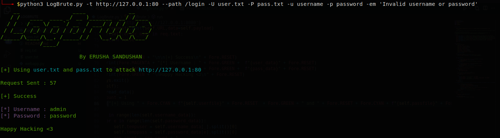

# LogBrute - Password Bruteforcer for login portals


### Installation

```bash
    git clone https://github.com/ErushaSandushan/LogBrute.git
    pip install -r req.txt
    python3 LogBrute.py
```

### Usage 
```bash
    usage: LogBrute.py [-h] -t TARGET -u USER_PARM -p PASS_PARM -em ERROR_MSG --path REQ_PATH -U
                    USER_FILE -P PASS_FILE

    optional arguments:
    -h, --help            show this help message and exit
    -t TARGET, --target TARGET
                            IP address or hostname of the target server
    -u USER_PARM, --userparm USER_PARM
                            Username parameter use on html login form. (<input name='username'>)
    -p PASS_PARM, --passparm PASS_PARM
                            Password parameter use on html login form. (<input name='password'>)
    -em ERROR_MSG, --error-msg ERROR_MSG
                            Error message prompts after entering wrong credentials.
    --path REQ_PATH       Path that login request make to server
    -U USER_FILE, --userfile USER_FILE
                            Username file path.
    -P PASS_FILE, --passfile PASS_FILE
                            Password file path.

    Example:
            
        python3 LogBrute.py -t http://127.0.0.1:80 --path /login -U user.list -P passwd.list -u user_parm -p pass_parm -em 'Invalid username or password'
        
    This tool crated mainly for CTF purpose . 
    ** Disclaimer: I'm not responsible for any illegal activities or damage by using this script. **
    if request make more data to server add it manually because I'm lazy programmer :D

```

### Examples

```bash
python3 LogBrute.py -t http://127.0.0.1:80 --path /login -U user.txt -P pass.txt -u username -p password -em 'Invalid username or password'
```
### Extra

* Use `webapp.py` to test this tool
```bash
    sudo python3 webapp.py
```

### Screenshot 
